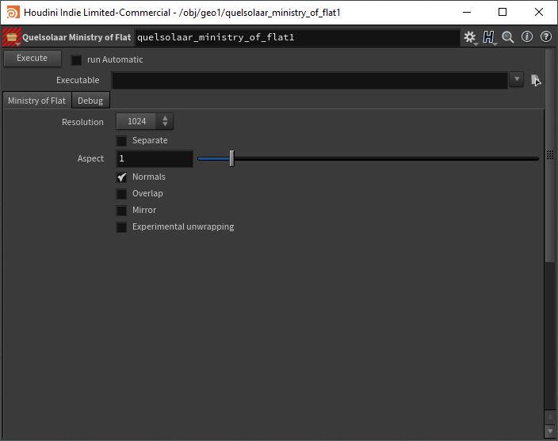
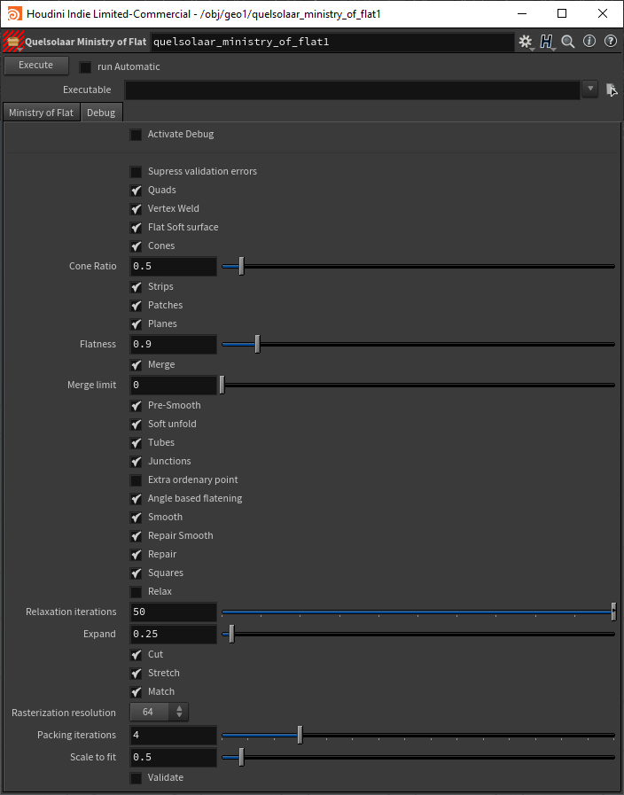

# Quelsolaar Ministry of Flat HDA

Simple HDA over Commandline Interface with Quelsolaar Ministry of Flat 

## Development

Currently under Development.

## Installation

1. Download Git Repository
2. copy the quelsolaar.json to the sub Houdini User Folder: package [Houdini Doc](http://www.sidefx.com/docs/houdini/ref/plugins.html) 
3. change the path inside the quelsolaar.json to this Folder
4. Run Houdini

## Video

[Demo](https://vimeo.com/412486255)

## Images

**Main Parameters**

**Debug Parameters**

## Ressources

[Website](http://www.quelsolaar.com/ministry_of_flat/)
