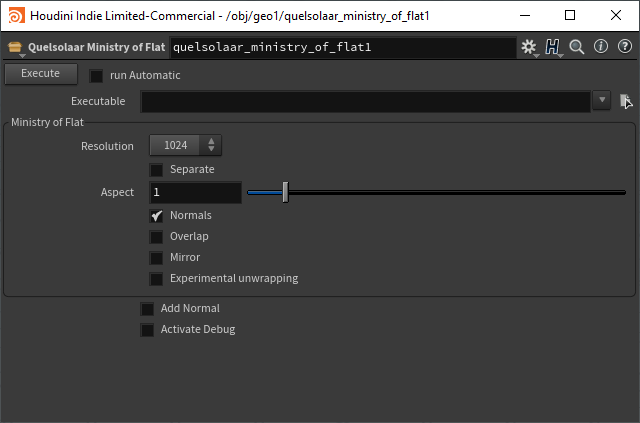
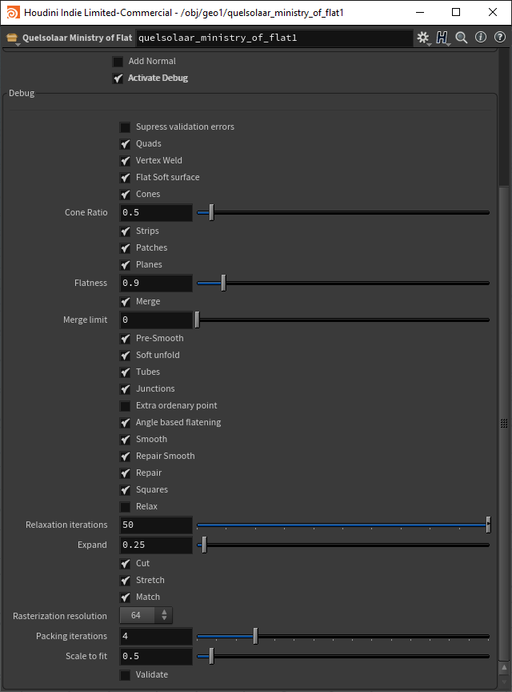

# Quelsolaar Ministry of Flat HDA

Simple HDA over Commandline Interface with Quelsolaar Ministry of Flat 

## Development

Currently under Development just don't use it. Doesn't work!

## Installation

Use the Package JSON file for Houdini. 
You need to set the path Manualy in the file.

## Images

**Main Parameters**

**Debug Parameters**

## Ressources

[Website](http://www.quelsolaar.com/ministry_of_flat/)
